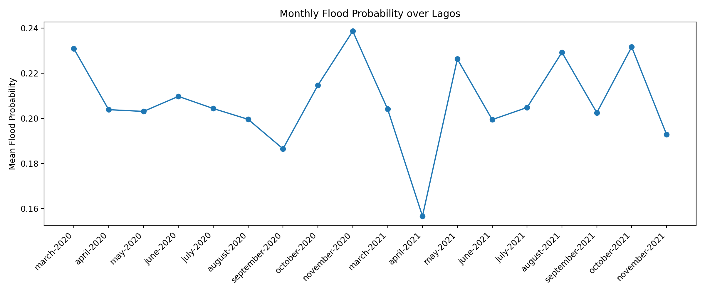
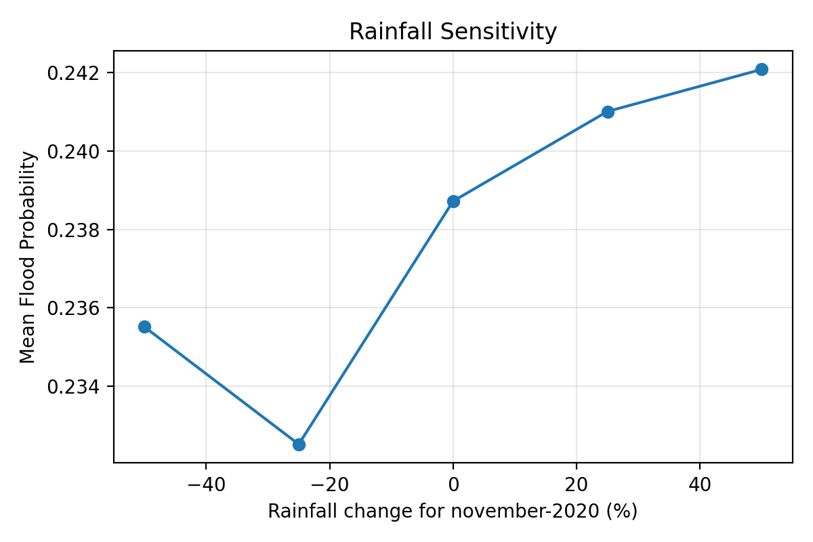

# Lagos Flood Hotspots: GIS + Machine Learning Pipeline

This repository contains a complete, reproducible workflow to build a machine-learning flood risk model for Lagos, Nigeria. It includes data preprocessing (merge, clip, reproject, resample, normalize), dataset assembly, Random Forest training, evaluation, and generation of geospatial prediction products (GeoTIFFs) and communication-ready charts/PNGs suitable for decision makers and QGIS mapping.

The project focuses on a local-scale proof-of-concept: identifying flood-prone hotspots and producing clear visual outputs for planning and evacuation support.

---
## Preview Image
- 

---

## 1. Objectives

- Build an ML model that estimates per-pixel flood probability across Lagos.
- Produce flood risk maps and derivative products ready for QGIS and reporting.
- Demonstrate an end-to-end geospatial ML workflow (Python + GIS + ML).

---

## 2. Study Area & Data Sources

**Study Area:** Lagos, Nigeria (wards boundary).

**Data sources:**
- **Elevation (DEM):** SRTM 30 m (NASA). Used for elevation and slope.
- **Rainfall:** CHIRPS (~5 km), monthly rasters for 2020–2021.
- **Land Cover:** ESA WorldCover 10 m.
- **Population:** WorldPop 100 m Nigeria population.
- **Flood Labels:** Digitized flood presence (ward polygons), rasterized to DEM grid.

All rasters are standardized to a common grid for modeling:
- CRS: `EPSG:32631` (WGS 84 / UTM zone 31N)
- Pixel size: `40 m`
- Bounds & grid aligned to the DEM.

> Note: All source data were clipped to Lagos and processed into `final_40m/` as ML-ready rasters.

---

## 3. Repository Structure

```
Flood_Hotspots_Project/
    align_all_rasters.py
    Build_Dataset.py
    check_shapes.py
    config.py
    Derive_Slope.py
    full_preprocessing_pipeline.py
    list_files.py
    list_layers.py
    Normalize_Rasters.py
    Rasterize_Flood_Labels.py
    Resample_Rasters.py
    train_flood_rf_model.py
    __init__.py
    assets/
        Flood Risk Probability.png
        Flood Risk- April 2020.png
        Flood Risk- April 2021.png
        Population Influence Map.png
    final_40m/
    outputs/
        training_log.txt
    predictions/
        charts_and_tables.py
        flood_probability_map.py
        flood_risk_prob_colored.tif
        generate_all_outputs.py
        influencemaps.py
        monthly_flood_predictions.py
        risk_class_map.py
        scenario_simulations.py
        output/
            monthly_flood_probabilities.csv
            monthly_flood_probabilities.png
            rainfall_sensitivity.png
    raw/
        lagos-ward-floods.gpkg
        chirps/ ... (monthly rasters)
        dem/ ... (SRTM tiles)
        pop/ ... (WorldPop)
        world-cover/ ... (ESA WorldCover tiles)
    utils/
        reproject_boundary.py
```

Key folders:
- `final_40m/` – Final ML-ready rasters (aligned, normalized).
- `outputs/` – Trained model, dataset CSV, training log.
- `predictions/` – Scripts to create final maps and charts.
- `predictions/output/` – Exported GeoTIFFs and PNGs for sharing.

---

## 4. End-to-End Workflow

### Step A — Preprocessing (Python)
- Reproject DEM, merge tiles, clip to Lagos.
- Convert WorldCover and Population to target CRS/grid.
- Clip CHIRPS first in native CRS, then reproject to the DEM grid.
- Normalize continuous rasters to [0, 1].
- Rasterize flood labels from the Lagos wards GeoPackage to match DEM grid.

Script(s): `full_preprocessing_pipeline.py` (and helpers as needed).  
Outputs to: `final_40m/`

### Step B — Build Dataset
- Stack all ML-ready rasters into a tabular dataset (one row per pixel).
- Include: DEM, WorldCover (encoded), Population, Monthly CHIRPS.
- Label: `flood_labels_40m.tif`

Script: `Build_Dataset.py`  
Output: `outputs/lagos_flood_dataset.csv`

### Step C — Train Model
- Algorithm: Random Forest (scikit-learn).
- Split train/test, remove all-zero feature rows, fit model, evaluate.
- Persist model as `flood_rf_model.pkl` and record metrics to `training_log.txt`.

Script: `train_flood_rf_model.py`  
Outputs: `outputs/flood_rf_model.pkl`, `outputs/training_log.txt`

### Step D — Predictions & Products
- Full probability map (`flood_risk_prob_colored.tif`).
- Classified risk map (`flood_risk_class_colored.tif`).
- Monthly rainfall-only predictions (`flood_pred_*.tif`).
- Influence maps for DEM, LandCover, Population.
- Charts & tables: monthly flood probabilities, rainfall sensitivity.

Scripts in `predictions/`:
- `flood_probability_map.py`
- `risk_class_map.py`
- `monthly_flood_predictions.py`
- `influencemaps.py`
- `charts_and_tables.py`
- `scenario_simulations.py`
- `generate_all_outputs.py` (to run everything at once)

Outputs in: `predictions/output/`

---

## 5. Model Evaluation (from `training_log.txt`)

Loaded dataset: 4,230,088 rows × 22 columns  
Removed 1,249,707 empty rows (all-zero features) → 2,980,381 rows used.

Train/Test split: 2,384,304 / 596,077

**Random Forest (200 trees)**
- Accuracy: 98.24%

**Classification Report**
```
              precision    recall  f1-score   support
         0.0      0.982     1.000     0.991    557357
         1.0      0.992     0.734     0.844     38720
    accuracy                          0.982    596077
   macro avg      0.987     0.867     0.917    596077
weighted avg      0.983     0.982     0.981    596077
```

**Confusion Matrix**
```
[[557133    224]
 [ 10295  28425]]
```

**Top Features**
```
april-2021_40m_norm       0.079268
november-2020_40m_norm    0.069842
june-2021_40m_norm        0.060020
june-2020_40m_norm        0.058308
july-2020_40m_norm        0.057529
november-2021_40m_norm    0.055795
may-2021_40m_norm         0.054778
august-2021_40m_norm      0.054397
march-2021_40m_norm       0.053409
march-2020_40m_norm       0.048759
```

Interpretation: Rainfall months are strong predictors, which is expected. The model recalls ~73% of flooded pixels; precision and overall accuracy are high. This is reasonable for a pilot with one flood labeling layer.

---

## 6. Core Outputs

| File | Description |
|------|-------------|
| `predictions/output/flood_risk_prob_colored.tif` | Continuous flood probability map (0–1), colorized. |
| `predictions/output/flood_risk_class_colored.tif` | Classified risk zones (Low/Moderate/High), colorized. |
| `predictions/output/flood_pred_<month-year>.tif` | Monthly rainfall-only risk predictions (20 rasters). |
| `predictions/output/influence_dem.tif` | Terrain contribution (partial dependence). |
| `predictions/output/influence_population.tif` | Population contribution. |
| `predictions/output/influence_landcover.tif` | Land cover contribution. |
| `predictions/output/monthly_flood_probabilities.csv` | Summary table of monthly risk. |
| `predictions/output/monthly_flood_probabilities.png` | Chart of monthly risk. |
| `predictions/output/rainfall_sensitivity.png` | Sensitivity of flood probability to rainfall. |

Example preview images (from `assets/` or `predictions/output/`):

- 
- 
- 
- 
- 

> For QGIS: load the colorized GeoTIFFs directly. They are georeferenced and ready to export as PNG maps with scale, legend, and labels.

---

## 7. How to Run

### Environment
Python 3.10+ recommended.

Install core packages (minimal):
```bash
pip install numpy pandas scikit-learn joblib rasterio matplotlib
```
If you plan to run vector steps that rely on GeoDataFrames:
```bash
pip install geopandas pyogrio shapely
```

### Commands (Windows / cross-platform)
From the repository root (where `Flood_Hotspots_Project/` lives):

1) (Optional) Preprocess end-to-end (if you need to rebuild)
```bash
python Flood_Hotspots_Project/full_preprocessing_pipeline.py
```

2) Build the dataset
```bash
python Flood_Hotspots_Project/Build_Dataset.py
```

3) Train the model
```bash
python Flood_Hotspots_Project/train_flood_rf_model.py
```

4) Generate prediction products
```bash
# Single products
python -m Flood_Hotspots_Project.predictions.flood_probability_map
python -m Flood_Hotspots_Project.predictions.risk_class_map
python -m Flood_Hotspots_Project.predictions.monthly_flood_predictions
python -m Flood_Hotspots_Project.predictions.influencemaps
python -m Flood_Hotspots_Project.predictions.charts_and_tables

# Or all at once
python -m Flood_Hotspots_Project.predictions.generate_all_outputs
```

Outputs will appear in `predictions/output/`.

---

## 8. How the Model Learns With One Label Layer

- The model is trained to discriminate between flooded vs. non-flooded pixels using DEM, land cover, population, and monthly rainfall features.
- Even with one flood label layer, the model leverages spatial variation in rainfall (20 monthly rasters) and static predictors to learn nonlinear rules about flood propensity.
- Feature importance indicates rainfall months are strong drivers; terrain/population/land cover further modulate risk.

For communication:
- Use `Flood Risk Probability.png` as the evacuation hotspot map.
- Add `Population Influence Map.png` to highlight high-risk, densely populated areas.

---

## 9. QGIS Export Cheatsheet

1. Layer → Add Raster Layer… → pick a colorized GeoTIFF (e.g., `flood_risk_class_colored.tif`).
2. Add XYZ basemap (optional) for context and place beneath the raster.
3. Project → New Print Layout → Add Map; insert legend, scale bar, north arrow, title.
4. Layout → Export as Image → PNG, 100 DPI for print-quality.

---

## 10. Citation & Credits

- SRTM (NASA): Digital Elevation Model
- CHIRPS: Rainfall (Climate Hazards Center, UCSB)
- ESA WorldCover: Land Cover
- WorldPop: Population
- Lagos wards boundary: Local administrative layer (as supplied in `raw/`)

---

## 11. Author & Repository

- Author: **Jubemi Anthony Pajiah**  
- Email: **jubemi.pajiah@eng.uniben.edu**, **pajiahjubemi@yahoo.com**  
- Repository: https://github.com/Jubemi-Pajiah/ML-Projects

If you find this useful, feel free to open an issue or a pull request.
